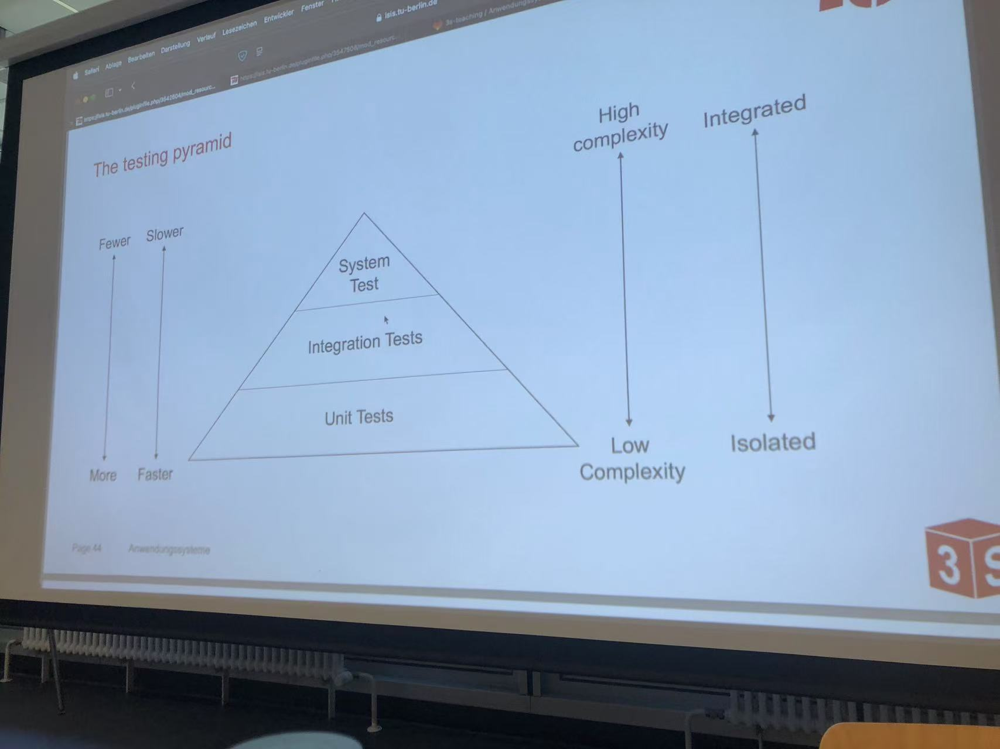

# 1 Test with JUnit



All files located in a specific test folder (usually src/test/java) are considered tests and will not be packaged into the final artifact.
In this test folder, every method with the annotation @Testwill be run as a test. Tests can also be configured by annotation methods, e.g.:
- @DisplayName: change the output name of the test (default is function name)
- @BeforeAll: run a method once before all tests in this class
- @BeforeEach: run a method once before every single test
- @Order(int num): run the tests in a specific order
Inside a test method, the class Assertionsaids with asserting conditions in tests, e.g. with the methods assertEquals(expected, actual), assertTrue(value), assertFalse(value), assertNull(value), etc.
=> If an assertion fails, the test does not pass.


# 2 logging with Log4j

Typical log levels are (in decreasing order of severity):
- Fatal: Errors that cause the program to terminate
- Error: Unexpected errors that should be visible immediately
- Warning: Undesirable situations that are not necessarily wrong
- Info: Informational messages to understand what the application is doing
- Debug: Detailed information that is useful when debugging the application
- Trace: Highest level of detail


Logging is handled via instances of the Loggerclass, which is usually obtained with the following snippet at the top of a class:

```java
publicclassMain {
    private staticfinal Logger log = LogManager.getLogger(Main.class);
    publicstaticvoidmain(String[] args) {
            log.info("Hello world!"); // couldprint"16:35:35.475 [main] INFO de.3s.Main -Hello world!“
            // dependingon configuration}}
```


==Lombok has the @Log annotation, which automatically creates the Logger log = …snippet.==


