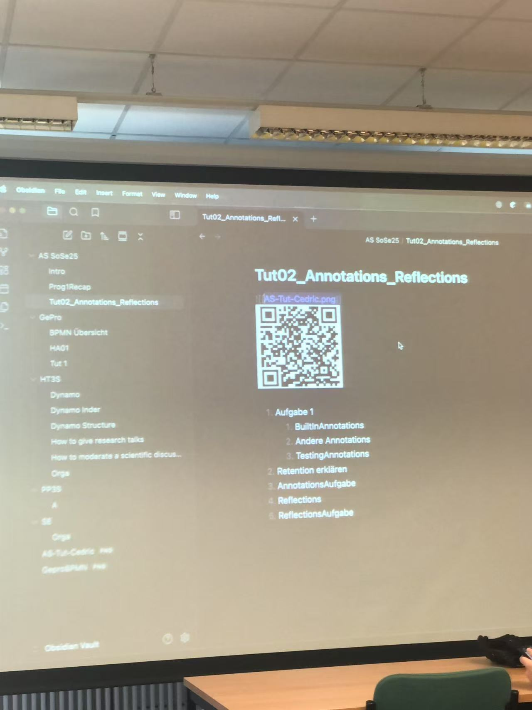
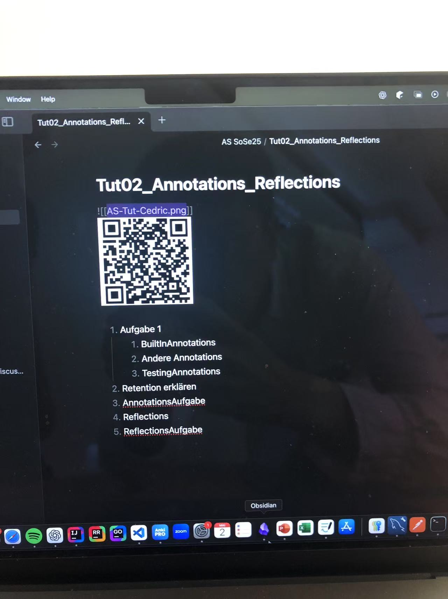
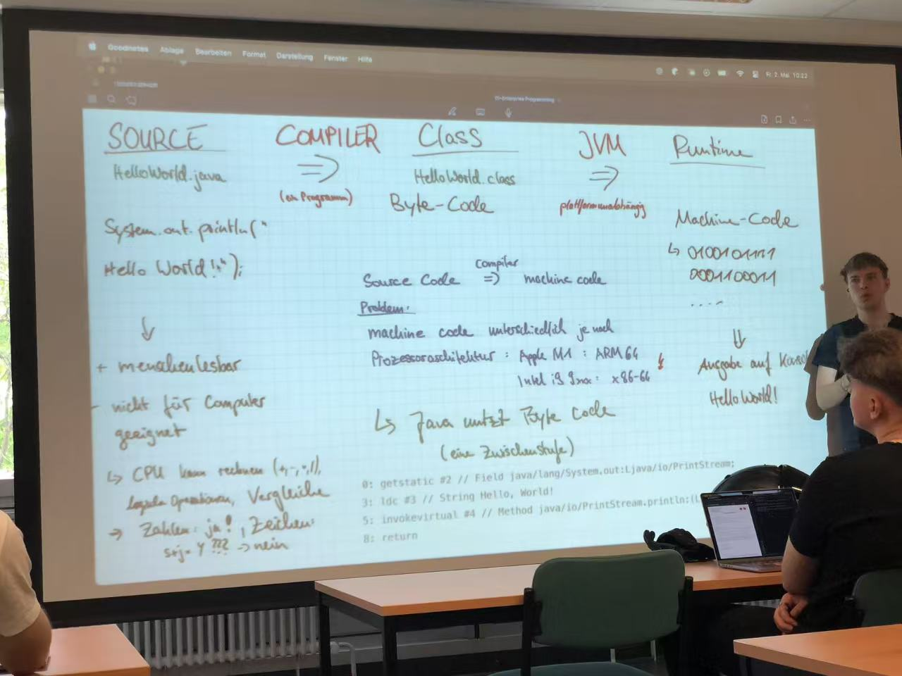
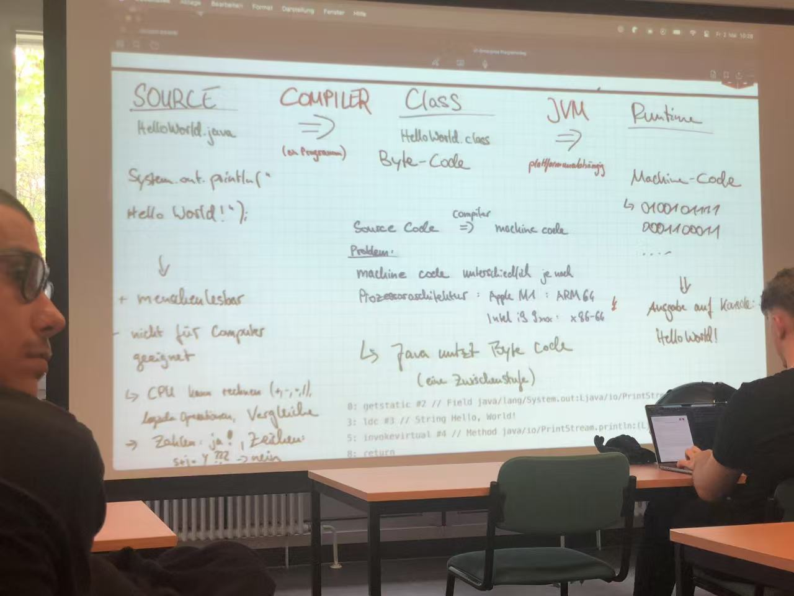
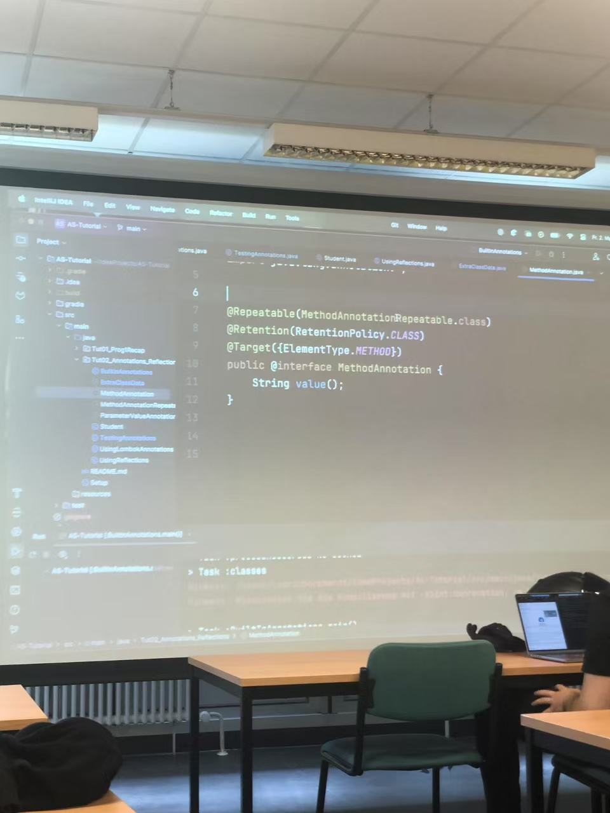
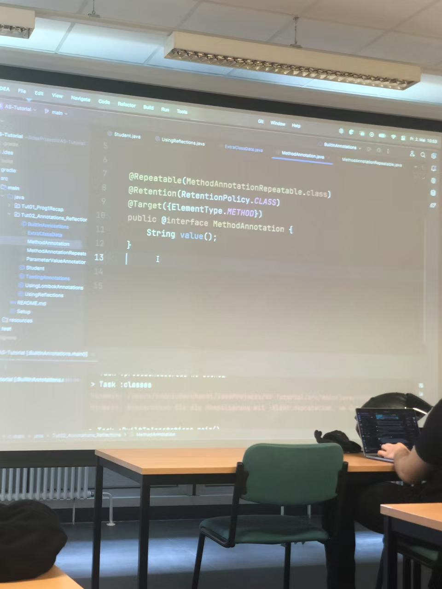
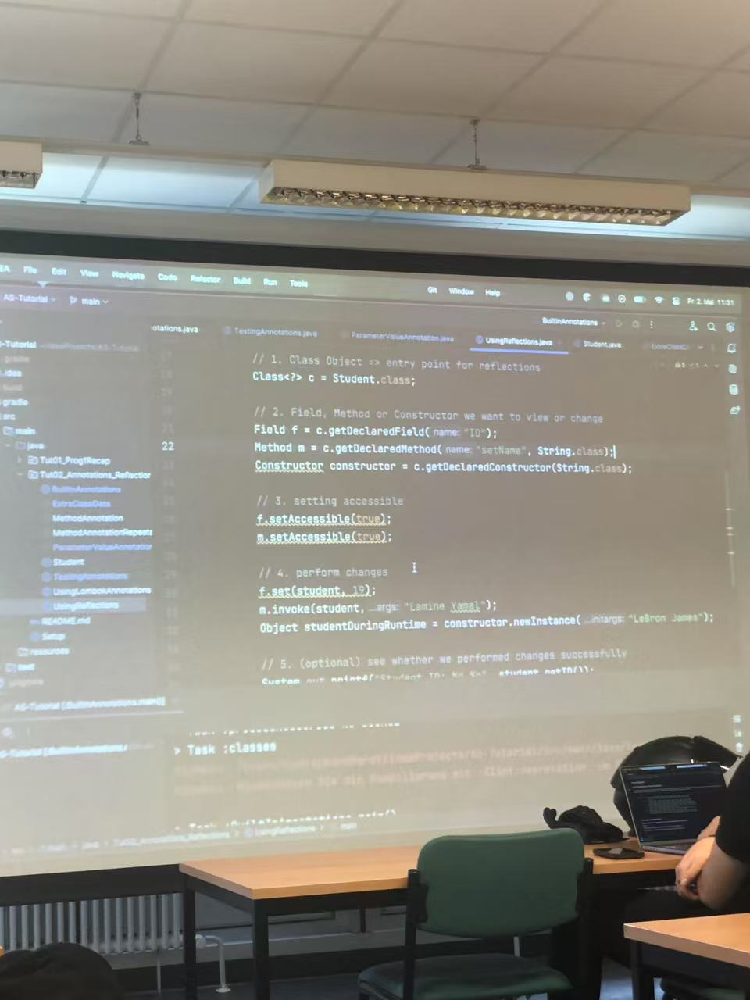
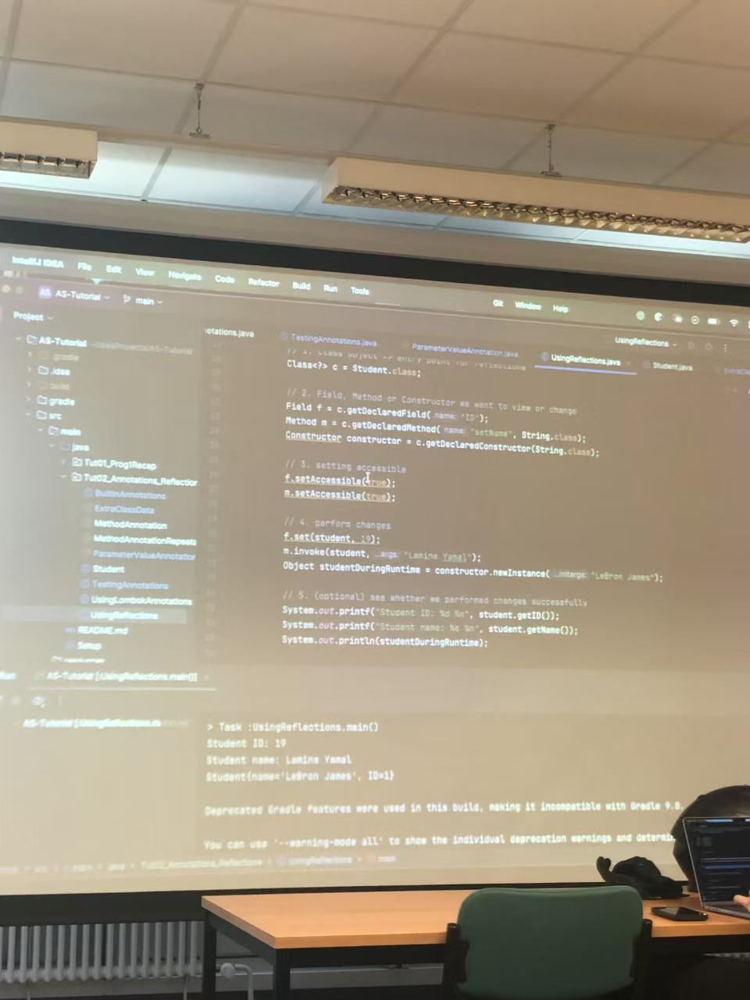

https://git.tu-berlin.de/users/sign_in

alle tutotium in demseble gitlab repo 







# 1 Complier 和 JVM 的关系 






# 2 Aufgabe 1: Annotations Intro
• Wof¨ur k¨onnen Annotations in Java (und anderen Programmiersprachen) benutzt werden?
• Welche Annotations sind in Java eingebaut?
• Welche Retentions und Targets k¨onnen Java Annotations haben?
• Welche Retentions und Targets haben die in Java eingebauten Annotations?

## 2.1 例子
@override
anatonation geben 
Complier uberchecken , ob in subclass die Methode exisitieren oder nicht 

@deprecated 

There are some built-in annotations which you might already have seen, e.g.:
@Override – the annotated element is meant to override element in superclass. If its not found in one of the superclasses, cause a compilation error
@SuppressWarnings – ignore compile-time warnings for this element
@Deprecated – marks a method as deprecated. Causes a compiler warning if the method is used.


@Target

@Target is an annotation for annotating definitions of annotation types. It restricts the kind of element the
annotation can be used on, i.e., where in the source code an annotation can be written.
It expects a single parameter of the ElementType enum describing said target:
- ANNOTATION_TYPE : Other annotations
- CONSTRUCTOR : Constructor declarations
- FIELD : Variable declarations in a class or object
- LOCAL_VARIABLE : Local variable declarations in a function
- METHOD : Method declarations
- PACKAGE: Package declarations
- PARAMETER : Parameters of a function
- TYPE : Type declarations (class, interface, enum, or annotation type declarations)
- TYPE_PARAMETER : Generic type parameter declarations (in generic classes, interfaces, methods,
constructors)


---


String vaule()   define a method with name value  with data type Sting 






eien Annotation vielfach eingeben ? in welche Fall muss dasselebe Annotation vielfach eingebenen werden muss 


# 3 Aufgabe 2: Annotations
Schreiben Sie eine Annotation mit dem Name ”MyAnnotation”. Die Annotation soll folgende Eigenschaften
haben:
• Einen Parameter vom Typ: String, der ¨ubergeben werden kann, ohne dass der Name des Parameters
explizit angegeben werden muss.
• Einen Parameter vom Typ: int, mit dem Namen ”count”, der standartm¨aßig 9001 ist.
• Einen Parameter vom Typ: `String[]`, mit dem Namen ”arrayParam”, der standartm¨aßig leer ist.

Stellen Sie sicher, dass die Annotation mit Klassen benutzt werden kann und zur Laufzeit verf¨ugbar
ist. Schreiben Sie eine neue Klasse, die Sie mit ”MyAnnotation¨annotieren. Schreiben Sie eine eine main-
Methode, die die toString-Methode der Annotation dieser Klasse auf der Konsole ausgibt. Erweitern Sie
das Programm so, dass eine Klasse mehrfach mit ”MyAnnotation¨annotiert werden kann.

```
import java.lang.annotation.Retention;
import java.lang.annotation.RetentionPolicy;
import java.lang.annotation.Target;
import java.lang.annotation.ElementType;
import java.lang.annotation.Repeatable;

@Retention(RetentionPolicy.RUNTIME)
@Target(ElementType.TYPE)
@Repeatable(MyAnnotations.class) // erlaubt Mehrfachanwendung
public @interface MyAnnotation {
    String value();                      // muss ohne Namen übergeben werden
    int count() default 9001;           // Standardwert 9001
    String[] arrayParam() default {};   // Standardwert: leeres Array
}
```

# 4 Lombok 


wenn @setter
Lombok , (durch Complier :   Source -> Complier -> Class)   , Complier add the setter and getter fucntion for each class variable   into Class (Byte Code ) , although they are not wirtten in the Source Code (mensch readable code )


@Setter 除了可以定义在 class 外, 还可以 定义在  variable 前面 

```
@ToString
@EqualsAndHashCode
@AllArgsConstructor
@Log
public class User {
private @Getter @Setter String name;
private @Getter @Setter boolean loggedIn;
private @Getter @Setter String profileUrl;
private @Getter int age;
User() {
log.info("Hello from No-Args Constructor");
}
}
```

---


# 5 Reflection 


in Runtime, new Object reinzuschreiben
in RUntim. Object zu query 


## 5.1 tutor 课上的例子 







@


# 6 Aufgabe 5: Annotations + Reflections

Schreiben Sie eine Annotation mit dem Namen CallMeMaybe. Die Annotation soll zur Laufzeit verf¨ugbar
sein, und mit ihr sollen Methoden annotiert werden k¨onnen. Die Annotation soll keine Parameter haben.
Erstellen Sie eine neue Klasse ExampleClass mit einigen Methoden, die jeweils keine Parameter ¨ubergeben
bekommen d¨urfen und annotieren Sie einige dieser Methoden mit @CallMeMaybe. Erstellen Sie jetzt eine
weitere Klasse CallMeMaybeMain. Implementieren Sie in dieser Klasse eine Methode maybeCallElements
mit folgender Funktionalit¨at:
• Die Methode bekommt als Parameter eine beliebige `Class<?> `¨ubergeben.
• Zuerst wird von dieser Class eine neue Instanz erstellt.
• Dann sollen alle Methoden der Klasse analysiert werden
– Wenn die Methode mit @CallMeMaybeMain annotiert ist, soll sie zuf¨allig in 50% der F¨alle auf-
gerufen werden.
– Wenn sie nicht annotiert ist, soll nichts passieren (oder ggf. ein debug-statement soll ausgegeben
werden.)
Schreiben Sie nun eine main-Methode in CallMeMaybeMain, die maybeCallElements(ExampleClass.class)
aufruft.


getDeclaredMethods(): not get the method from Superclass , sonderen nur die methode, die mit Annotation @callMeMaybe gesetzt sind 
