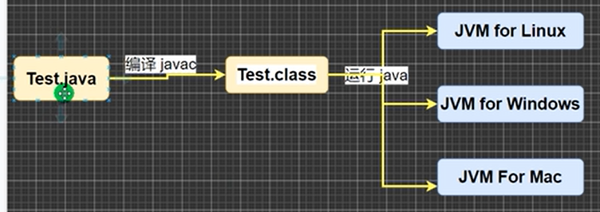
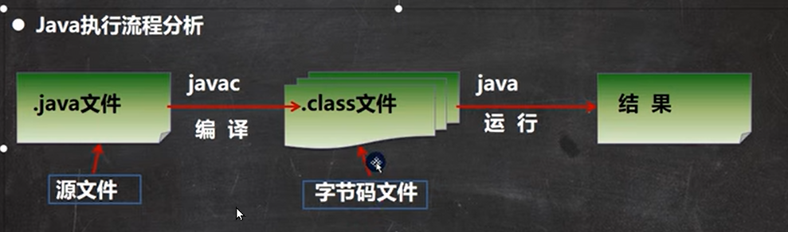
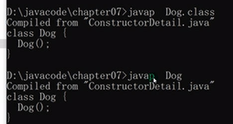
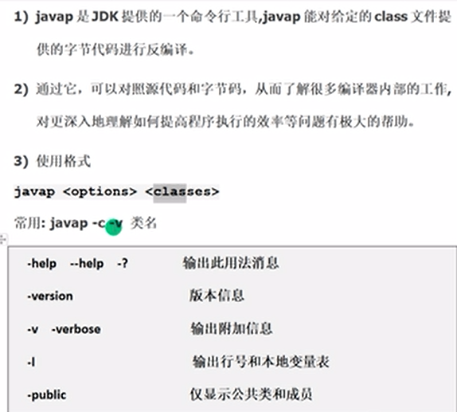
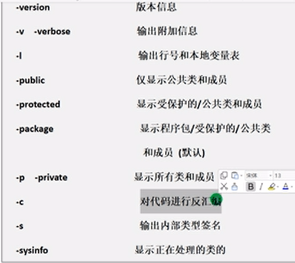
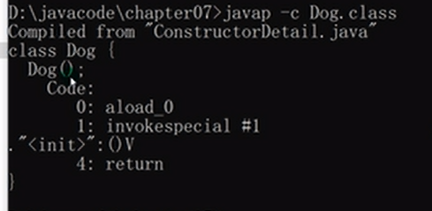

# Ausführung und Übersetzung eines Java-Programms
- Der Compiler (javac) übersetzt den Quelltext (.java) in plattformunabhängigen Bytecode (.class).
- Der Bytecode kann von einem Java-Interpreter, der Virtuellen Maschine, auf dem Sver  ausgeführt werden.
![[image/Pasted image 20230403175603.png]]

# javac (编译文件) 和 java (运行程序)

# javac 编译

编译： 用 javac 命令 编译 Test.java， 生成 Test.class这个字节码文件 

- 指令： javac Hello.java
- 有了java 源文件， 通过编译器将其编译成JVM可以识别的字节码文件 

# java 运行

- 通过 运行 java.exe 对字节码文件 Test.class 进行执行。**本质是.class 装在到 jvm 机中执行**
- 指令： java Hello . 注意大小写。 而不能写成 java Hello.class ，会报错
  - java Hello, java 会运行 名字为 Hello 这个 class
  - java Hello.class , 会运行 名字为 Hello.class 这个 类

# javap 反汇编

- javap 的exe 在 jdk8/bin 目录下
- 例子： javap Dog.class 或者 javap Dog (自动知道 Dog 就代表 Dog.class)
  - 把Dog.class 这个字节码， 反编译为一个 人可以阅读的类
  - 

## javap 的使用说明

- 
- 

## 例子

- java -p 显示所有的类 和 其成员
- javap -c Dog.class: -c 為反汇编
  - 
