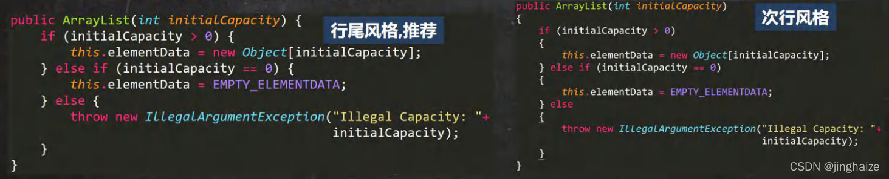

1.类、方法的注释，要以javadoc的方式来写。
2.非Java Doc的注释，往往是给代码的维护者看的，着重告述读者为什么这样写，如何修改，注意什么问题等
3.使用tab操作，实现缩进，默认整体向右移动，或者用shift+tab整体向左移
4.运算符和 = 两边习惯性各加一个空格。比如：2 + 4 * 5 + 345 - 89
5.源文件使用的是utf-8编码
6.行宽度不要超过80字符
7.代码编写次行风格和行尾风格

- 
