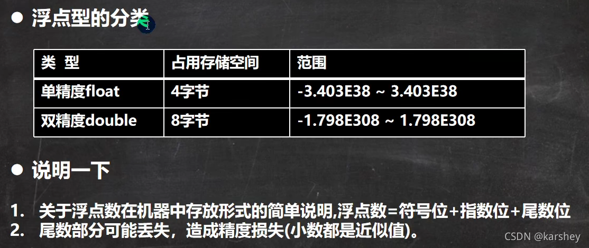

# 总览


# 整数类型


- java 的整数类型的默认值 <font color =red>默认为 int 类型 </font>

- **声明long常量需要加l或L**

# 浮点数类型



- 浮点数在机器中的存放形式： **浮点数= 符号位+指数位+尾数位**

- **尾位数部分可能丢失**， 在传输的时候 造成精度损失。 所以说 小数都是近似值

- java 浮点数类型的常亮<font color =red>默认为 double类型 </font>

- 声明float要在小数后加f或F
  
  - ```java
      public class temp{
      public static void main(String[] args){
    //       float number = 1.1;//错的 1.1是double 放进float会精度丢失
          float number = 1.1F;//对的
          System.out.println(number);
      }
    }
    ```

- 浮点数长常亮有两种表现形式 
  
  - 十进制数的形势： 5.12, 512.0f, .512 必须有小数点
  
  - 科学计数法的形势： 5.12e2[], 5.12E-2 []

## 浮点数使用陷阱 2.7 和 8.1/3

```java
public class temp{
    public static void main(String[] args){
        double num1 = 2.7;
        double num2 = 8.1/3;  
        System.out.println(num1); // 结果显示为 2.7
        System.out.println(num2);   // 显示为 2.699999999999997
    }
}
```

- 计算机以为  8.1  有可能是 8.100000000000001， 因此 结果是 2.699999999999997

- 8.1/3不是2.7；因此，<font color =red>判断两个浮点数是否相等不能用等于号</font>，而是判断它们的差的绝对值是否在某个范围内（当浮点数参与了运算会产生精度的误差）
  
  - ```java
    public class temp{
        public static void main(String[] args){
            double num1 = 2.7;
            double num2 = 8.1/3;
            // System.out.println(num1);
            // System.out.println(num2);
            if(Math.abs(num1-num2)<0.001){
                System.out.println("相等");
            }
        }
    }
    ```

# 字符类型

## char, 单个字符

### 例子

```java
char c1 = 'a';

char c2 = '\t'
char c3 = '我'

char c4 = 97. // char 也可以来存数字。因为char 的本质是整数。 97 就代表 字符 a
```

### 重点

- 单引号’’， 双引号为 string 类型
- 不能用 双引号
- 可用转义字符
- <font color =red>char 本质是整数，是Unicode码对应的字符（所以输入整数输出字符） </font>
  - 通过 (int) c3, 已经将 char 类型的 c3 变量，转成他对应的 Unicode 的值
- 可运算, 因为他相当于一个整数。 有对应的 Unicode 码
  - 'a' + 10  =  107 , 因为 a 的 unicode 的值为 97 
- Unicode编码可以汉字

### 字符类型的本质 （字符和码值）


#### ASCII


#### Unicode

Unicode 兼容 ASCII 


#### UTF-8


# boolean 布尔类型


- <font color =red>java 中 不可以 1 或者 0 来代替 false/ture </font>
