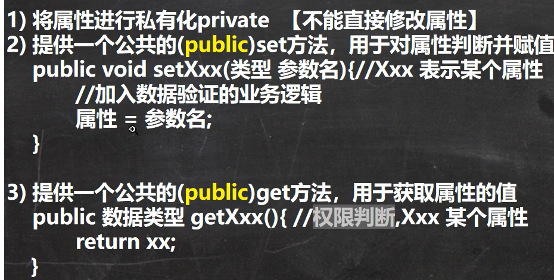
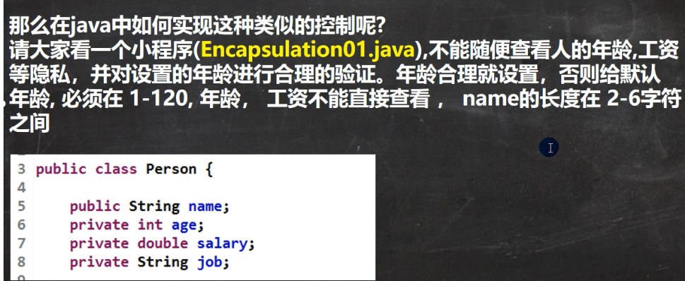
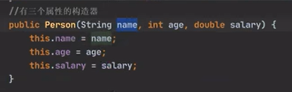
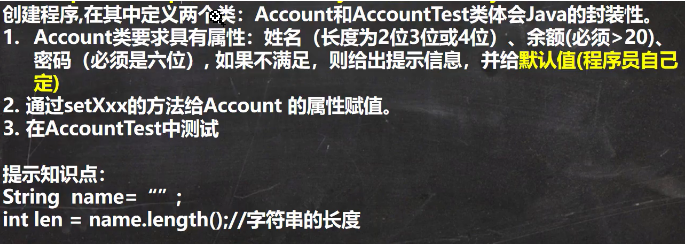

# 1 基本介绍

面向对象编程有三大特征：封装、继承和多态。
封装就是包冲向出的数据[即为属性] 和对数据操作[即为方法]， 封装在一起，数据被保护在内部。 程序的其他部分只有通过被授权的操作[方法]，才能对数据惊醒操作

## 1.1 封装的好处

- 隐藏实现细节
  - 方法（连接数据库） <-- 调用（传入参数）
- 对数据进行验证，保证安全合理

## 1.2 封装的步骤

封装的实现步骤，三步

1. 属性私有
2. set，可加入数据验证的业务逻辑
3. get，可加入权限判断，谁可以取到数据



# 2 IntellJ Idea 中的快捷键

快捷键生成get/set， 生成构造函数： Alt + Insert ， 然后选 create getter and setter in context menu

# 3 快速入门案例



```java
package com.hspedu.encap;
public class Encapsulation01 {
    public static void main(String[] args) {
        //如果要使用快捷键alt+r, 需要先配置主类
        //第一次，我们使用鼠标点击形式运算程序，后面就可以用
        Person person = new Person();
        person.setName("韩顺平");
        person.setAge(30);
        person.setSalary(30000);
        System.out.println(person.info());
        System.out.println(person.getSalary());
        //如果我们自己使用构造器指定属性
        Person smith = new Person("smith", 80, 50000);
        System.out.println("====smith 的信息======");
        System.out.println(smith.info());

    }
}
/*
那么在java 中如何实现这种类似的控制呢?
请大家看一个小程序(com.hspedu.encap: Encapsulation01.java),
不能随便查看人的年龄,工资等隐私，并对设置的年龄进行合理的验证。年龄合理就设置，否则给默认
年龄, 必须在1-120, 年龄， 工资不能直接查看， name 的长度在2-6 字符之间
*/
class Person {
    public String name; //名字公开
    private int age; //age 私有化
    private double salary; //..
    public void say(int n, String name) {}
    //构造器alt+insert
    public Person() {}
    //有三个属性的构造器
    public Person(String name, int age, double salary) {
        // this.name = name;
        // this.age = age;
        // this.salary = salary;

        //我们可以将set 方法写在构造器中，这样仍然可以验证
        setName(name);
        setAge(age);
        setSalary(salary);
    }
    //自己写setXxx 和getXxx 太慢，我们使用快捷键
    //然后根据要求来完善我们的代码.
    public String getName() {
        return name;
    }
    public void setName(String name) {
        //加入对数据的校验,相当于增加了业务逻辑
        if (name.length() >= 2 && name.length() <= 6) {
            this.name = name;
        } else {
            System.out.println("名字的长度不对，需要(2-6)个字符，默认名字");
            this.name = "无名人";
        }
    }
    public int getAge() {
        return age;
    }
    public void setAge(int age) {
        //判断
        if (age >= 1 && age <= 120) { //如果是合理范围
            this.age = age;
        } else {
            System.out.println("你设置年龄不对，需要在(1-120), 给默认年龄18 ");
            this.age = 18; //给一个默认年龄
        }
    }
    public double getSalary() {
        //可以这里增加对当前对象的权限判断
        return salary;
    }
    public void setSalary(double salary) {
        this.salary = salary;
    }
    //写一个方法，返回属性信息
    public String info() {
        return "信息为name=" + name + " age=" + age + " 薪水=" + salary;
    }
}
```

# 4 将构造器和setXxx 结合

- 生成构造器快捷键：Alt + Insert
- 构造器是否会破坏封装？会，怎么解决？=> 在构造器中写入set
- 构造器和setXxx结合

```java
//有三个属性的构造器
public Person(String name, int age, double salary) {
// this.name = name;
// this.age = age;
// this.salary = salary;
//我们可以将set 方法写在构造器中，这样仍然可以验证
setName(name);
setAge(age);
setSalary(salary);
}
```

## 4.1 普通的构造函数



# 5 课堂练习



```java
package com.hspedu.encap;
public class TestAccount {
    public static void main(String[] args) {
        //创建Account
        Account account = new Account();
        account.setName("jack");
        account.setBalance(60);
        account.setPwd("123456");

        account.showInfo();
    }
}
```

```java
package com.hspedu.encap;
/**
 * 创建程序,在其中定义两个类：Account 和AccountTest 类体会Java 的封装性。
 * Account 类要求具有属性：姓名（长度为2 位3 位或4 位）、余额(必须>20)、
 * 密码（必须是六位）, 如果不满足，则给出提示信息，并给默认值(程序员自己定)
 * 通过setXxx 的方法给Account 的属性赋值。
 * 在AccountTest 中测试
 */
public class Account {
    //为了封装，将3 个属性设置为private
    private String name;
    private double balance;
    private String pwd;
    //提供两个构造器
    public Account() {}
    public Account(String name, double balance, String pwd) {
        this.setName(name);
        this.setBalance(balance);
        this.setPwd(pwd);
    }
    public String getName() {
        return name;
    }
    //姓名（长度为2 位3 位或4 位）
    public void setName(String name) {
        if (name.length() >= 2 && name.length() <= 4) {
            this.name = name;
        } else {

            System.out.println("姓名要求（长度为2 位3 位或4 位），默认值无名");
            this.name = "无名";
        }
    }
    public double getBalance() {
        return balance;
    }
    //余额(必须>20)
    public void setBalance(double balance) {
        if (balance > 20) {
            this.balance = balance;
        } else {
            System.out.println("余额(必须>20) 默认为0");
        }
    }
    public String getPwd() {
        return pwd;
    }
    //密码（必须是六位）
    public void setPwd(String pwd) {
        if (pwd.length() == 6) {
            this.pwd = pwd;

        } else {
            System.out.println("密码（必须是六位）默认密码为000000");
            this.pwd = "000000";
        }
    }
    //显示账号信息
    public void showInfo() {
        //可以增加权限的校验
        System.out.println("账号信息name=" + name + " 余额=" + balance + " 密码" + pwd);
        // if() {
        // System.out.println("账号信息name=" + name + " 余额=" + balance + " 密码");
        // }else{
;
    }
}
```
